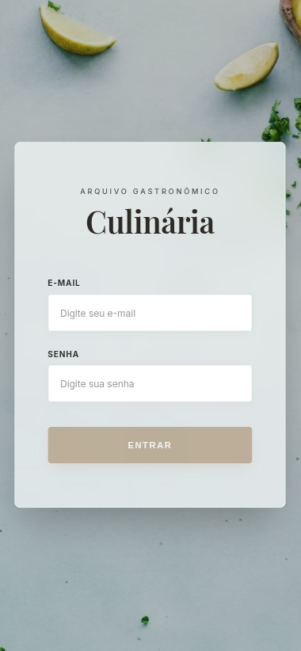

# 🍽️ Recipes APP

Aplicação web mobile-first para exploração, preparo e gerenciamento de receitas de comidas e bebidas.  
Projeto desenvolvido na Trybe, com foco em arquitetura React, organização de código e experiência do usuário.

---

## 1) Visão Geral

O **Recipes APP** permite que usuários:

- pesquisem receitas de comidas e bebidas,
- visualizem detalhes e modo de preparo,
- acompanhem o progresso de receitas em andamento,
- salvem receitas favoritas.

O projeto passou por uma refatoração estrutural e visual, com melhorias na organização do código, na reutilização de componentes e na consistência do design.

  Preview Mobile 
  

---

## 2) Funcionalidades

- 🔎 **Busca de Receitas**  
  Pesquisa por nome, ingrediente ou primeira letra.

- 🧩 **Categorias Dinâmicas**  
  Alternância entre receitas de comidas e bebidas.

- ✅ **Modo de Preparo (In Progress)**  
  Checklist interativo com persistência de progresso via LocalStorage.

- ⭐ **Sistema de Favoritos**  
  Gerenciamento de receitas favoritas com armazenamento local.

- 🔗 **Compartilhamento de Links**  
  Cópia rápida de links com feedback visual ao usuário.

---

## 3) Tecnologias e Conceitos Aplicados

### Stack Principal

- **React (Hooks e Context API)**  
  Componentização, estado global e separação de responsabilidades.
- **JavaScript (ES6+)**
- **HTML5 e CSS3**
- **React Router**
- **Integração com APIs externas**
  - TheMealDB (https://www.themealdb.com/)
  - TheCocktailDB (https://www.thecocktaildb.com/)

### Conceitos de Engenharia

- Organização modular de componentes
- Separação entre UI, lógica e serviços
- Reutilização de componentes
- Persistência de dados com LocalStorage
- Refatoração e melhoria de legibilidade do código

---

## 4) Melhorias Realizadas

- Refatoração da estrutura de componentes
- Reorganização da arquitetura do projeto
- Padronização de estilos e layout
- Redução de código duplicado
- Melhoria da legibilidade e manutenção do código
- Atualização da documentação do projeto

---

## 5) Roadmap de Evolução

- Implementação de hooks customizados
- Modularização avançada de estilos (CSS Modules ou Styled Components)
- Melhoria da camada de serviços e estado global
- Migração gradual para TypeScript

---

## 6) Equipe de Desenvolvimento

Projeto desenvolvido em colaboração por:

- Felipe Cardoso — UI/UX, refatoração e padronização de código  
  GitHub: https://github.com/fecardoso7
- João Felipe Zini — https://github.com/jfzini
- Luiz Arlochi — https://github.com/luizArlochi
- Glenno do Ouro — https://github.com/glennodoouro
- Jeoflan Junior — https://github.com/Jeoflan

---

## 7) Contexto do Projeto

Este projeto foi desenvolvido como parte da formação em desenvolvimento web na Trybe, com foco em React e boas práticas.